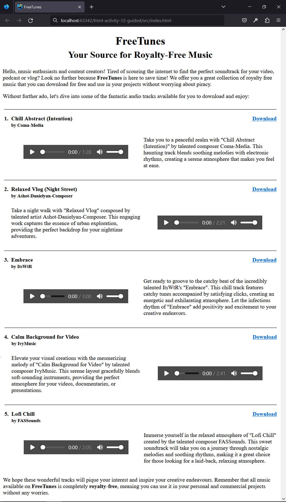
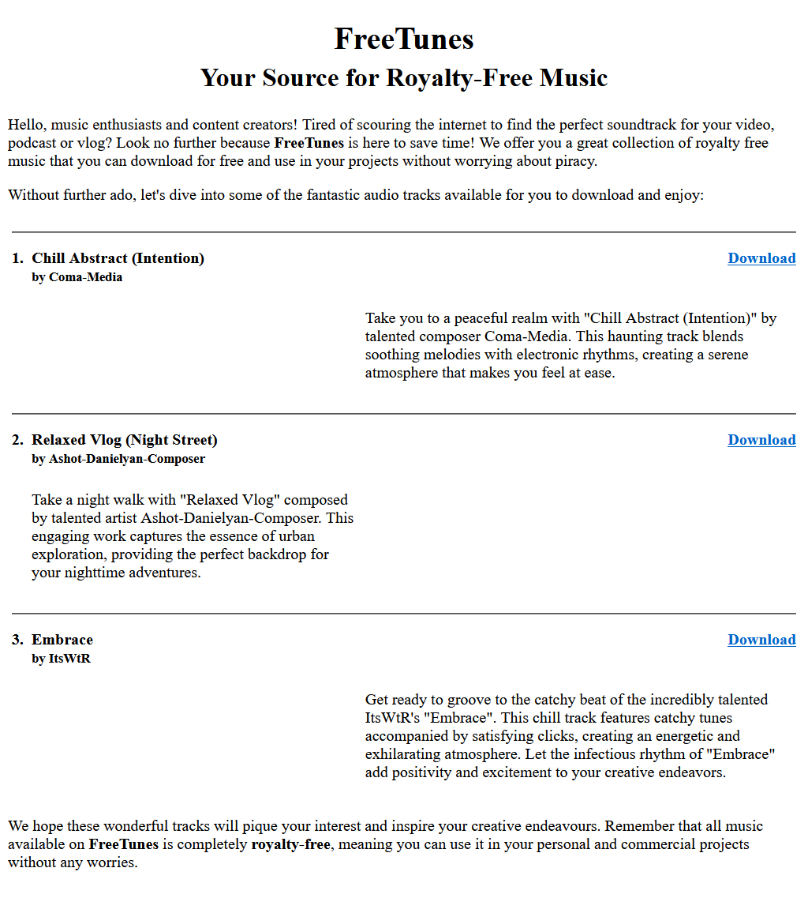
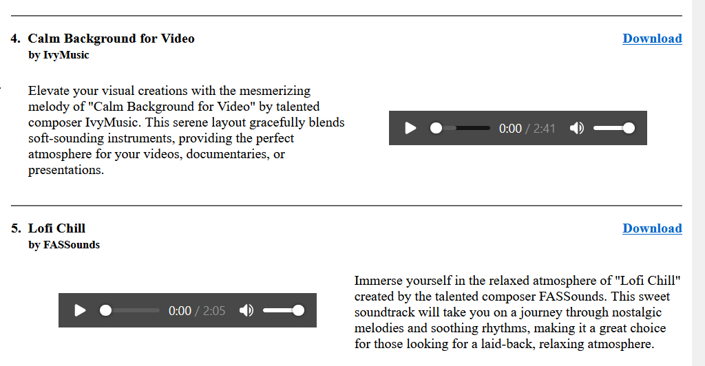

## HTML | Activity #12 (Guided): Audio
In this activity, we will create a simple **Audio Download Page** with the following content:




### Development Setup
Create your `index.html` file inside the [**src**](/src) folder in this project,
then follow along with this guide.

To test your output, simply open it in your preferred web browser.


### Template
First, we need a regular HTML template that already contains relevant texts and layout.



We will leave [comments](https://www.w3schools.com/html/html_comments.asp) for the parts that we will do later.

```html
<!DOCTYPE html>
<html lang="en">
<head>
    <meta charset="UTF-8">
    <title>FreeTunes</title>
</head>
<body>
    <div class="header" align="center">
        <h1>
            FreeTunes
            <br/>
            <small>Your Source for Royalty-Free Music</small>
        </h1>
    </div>

    <div class="intro">
        <p>
            Hello, music enthusiasts and content creators!
            Tired of scouring the internet to find
            the perfect soundtrack for your video, podcast or vlog?
            Look no further because <b>FreeTunes</b> is here to save time!
            We offer you a great collection of royalty free music
            that you can download for free and use in
            your projects without worrying about piracy.
        </p>
        <p>
            Without further ado, let's dive into some of the fantastic audio tracks available for you to download and enjoy:
        </p>
    </div>

    <div class="tracks" align="center">
        <table cellspacing="0" cellpadding="4">

            <!-- 1. Chill Abstract (Intention) -->
            <tr><td colspan="3"><hr/></td></tr>
            <tr>
                <td align="right" valign="top">
                    <b>1.</b>
                </td>
                <td valign="top">
                    <b>
                        Chill Abstract (Intention)
                        <br/>
                        <small>by Coma-Media</small>
                    </b>
                </td>
                <td align="right" valign="top">
                    <a href="audio/chill-abstract-intention.mp3" download>
                        <b>Download</b>
                    </a>
                </td>
            </tr>
            <tr>
                <td></td>
                <td align="center">
                    
                    <!-- Audio | Chill Abstract -->
                    
                </td>
                <td>
                    <p>
                        Take you to a peaceful realm with "Chill Abstract (Intention)"
                        by talented composer Coma-Media.
                        This haunting track blends soothing melodies with electronic rhythms,
                        creating a serene atmosphere that makes you feel at ease.
                    </p>
                </td>
            </tr>

            <!-- 2. Relaxed Vlog (Night Street) -->
            <tr><td colspan="3"><hr/></td></tr>
            <tr>
                <td align="right" valign="top">
                    <b>2.</b>
                </td>
                <td valign="top">
                    <b>
                        Relaxed Vlog (Night Street)
                        <br/>
                        <small>by Ashot-Danielyan-Composer</small>
                    </b>
                </td>
                <td align="right" valign="top">
                    <a href="audio/relaxed-vlog-night-street.mp3" download>
                        <b>Download</b>
                    </a>
                </td>
            </tr>
            <tr>
                <td></td>
                <td>
                    <p>
                        Take a night walk with "Relaxed Vlog" composed
                        by talented artist Ashot-Danielyan-Composer.
                        This engaging work captures the essence of urban exploration,
                        providing the perfect backdrop for your nighttime adventures.
                    </p>
                </td>
                <td align="center">
                    
                    <!-- Audio | Relaxed Vlog (Night Street) -->
                    
                </td>
            </tr>

            <!-- 3. Embrace -->
            <tr><td colspan="3"><hr/></td></tr>
            <tr>
                <td align="right" valign="top">
                    <b>3.</b>
                </td>
                <td valign="top">
                    <b>
                        Embrace
                        <br/>
                        <small>by ItsWtR</small>
                    </b>
                </td>
                <td align="right" valign="top">
                    <a href="audio/embrace.mp3" download>
                        <b>Download</b>
                    </a>
                </td>
            </tr>
            <tr>
                <td></td>
                <td align="center">
                    
                    <!-- Audio | Embrace -->
                    
                </td>
                <td>
                    <p>
                        Get ready to groove to the catchy beat of the incredibly talented ItsWtR's "Embrace".
                        This chill track features catchy tunes accompanied by satisfying clicks,
                        creating an energetic and exhilarating atmosphere.
                        Let the infectious rhythm of "Embrace" add positivity
                        and excitement to your creative endeavors.
                    </p>
                </td>
            </tr>
        </table>
    </div>

    <div class="outro">
        <p>
            We hope these wonderful tracks will pique your interest and inspire your creative endeavours.
            Remember that all music available on <b>FreeTunes</b> is completely <b>royalty-free</b>,
            meaning you can use it in your personal and commercial projects without any worries.
        </p>
    </div>
</body>
</html>
```


### Defining Audio Elements
To define an audio element in HTML, we use the `<audio>` tag.
Inside it, we nest one or more self-closing `<source/>` tags - each has
`src` attribute that contains the URL or path of the audio file with a specified `type`.

Example:
```html
<audio controls>
    <source src="sound.ogg" type="audio/ogg"/>
    <source src="sound.mp3" type="audio/mpeg"/>
</audio>
```

<p>
    <small>
        <b>NOTE:</b>
        We use multiple sources with different audio file formats
        to provide options in the event that one format is not supported or available.
    </small>
</p>

The `controls` attribute in the audio element is needed
to display the default audio controls, such as *play*, *pause*, and *volume*.
The audio element may not show up in the browser if this attribute is missing.

#### 1. Chill Abstract (Intention)
```html
                    ...

                    <!-- Audio | Chill Abstract -->
                    <audio controls>
                        <source 
                            src="audio/chill-abstract-intention.ogg" 
                            type="audio/ogg"
                        />
                        <source 
                            src="audio/chill-abstract-intention.mp3" 
                            type="audio/mpeg"
                        />
                    </audio>

                    ...
```

#### 2. Relaxed Vlog (Night Street)
```html
                    ...

                    <!-- Audio | Relaxed Vlog (Night Street) -->
                    <audio controls>
                        <source
                            src="audio/relaxed-vlog-night-street.ogg"
                            type="audio/ogg"
                        />
                        <source
                            src="audio/relaxed-vlog-night-street.mp3"
                            type="audio/mpeg"
                        />
                    </audio>
                    
                    ...
```

#### 3. Embrace
```html
                    ...
                    
                    <!-- Audio | Embrace -->
                    <audio controls>
                        <source
                            src="audio/embrace.ogg"
                            type="audio/ogg"
                        />
                        <source
                            src="audio/embrace.mp3"
                            type="audio/mpeg"
                        />
                    </audio>
                    
                    ...
```

The `<audio>` tag has other attributes such as:

| Attribute  | Description                                         |
|------------|-----------------------------------------------------|
| `autoplay` | Start playing as soon as the audio it is ready.     |
| `loop`     | Start over again, every time the audio is finished. |

***TODO:***
Include the `loop` attribute in all the audio elements,
and complete the page by adding the 4th and 5th content:



You can find all the audio files inside the [**audio**](src/audio) folder.
